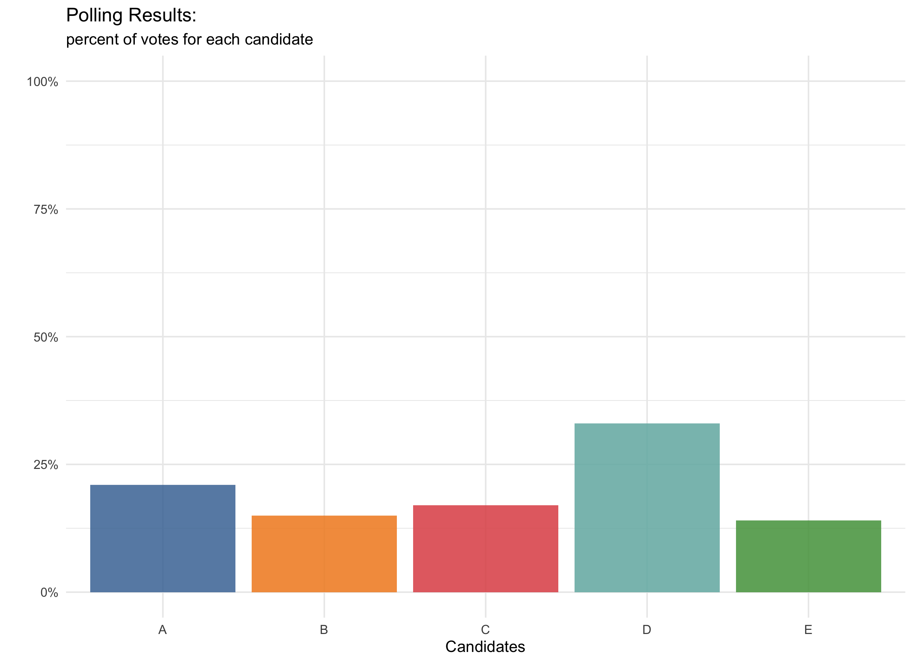
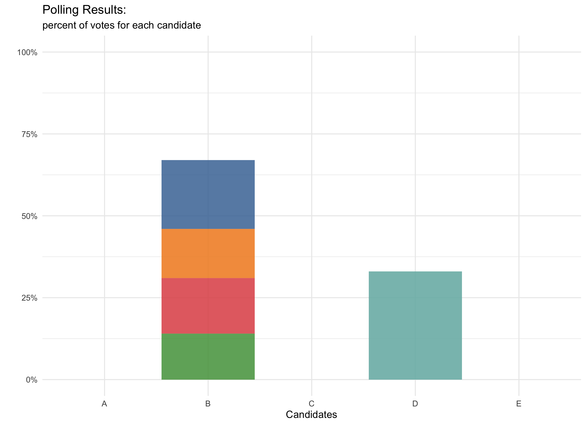

```{r setup, message=FALSE, echo = FALSE}
knitr::opts_chunk$set(echo = TRUE)
library(knitr)
library(kableExtra)
library(shiny)
library(shinyWidgets)
library(shinydashboard)
library(formattable)
library(ggthemes)
library(tidyverse)
library(fGarch)
library(scales)
library(DT)
library(plotly)


```


*Before we begin, if you are here for the actual interactive instant runoff voting (IRV) simulation, that is on the next tab, which you could skip to if you'd like. But I only made that simulation to demonstrate the idea of IRV. If you are unfamiliar with the concept, you should read on below! Hopefully you’ll give it some consideration and maybe share with people that are unfamiliar.*

### Election Time, Again

Every four years American citizens flock to the polls and fulfill their most central (and privileged) obligation – voting. But who gets excited about voting? In 2016, approximately 56% of the voting elligible population turned out for the election. That places us around [26th](https://www.pewresearch.org/fact-tank/2018/05/21/u-s-voter-turnout-trails-most-developed-countries/) amongst other developed countries. How do we expect to have a thriving democracy when only a relatively small percentage of the population makes their voices heard?

<span style="color:indianred">**How can we do better?**</span>

### How We Vote
A phrase: <span style="color:indianred">**first-past-the-post**</span>.  

In most elections (not necessarily federal government) we have what is commonly known as first-past-the-post (FPTP) voting. This is a form of plurality voting, which means a candidate doesn’t need the majority of votes (>50% of all voters), they just need more than all the others.
\
\
For example, if we look at the mock polls below, we can see that candidate "D" has the most votes but is nowhere near 50% (or more) of the population. This means two very important things:  
  
  1. The majority of voters *did not* vote for candidate "D"  
  2. Candidate "D" will still be the winner 
\
\
\
\
  

```{r, echo=FALSE, fig.cap="Polling Results From our Mock Poll", out.width = '85%', out.height= '85%', fig.align='center'}

```

### The Problem With First Past The Post Voting
The first and most obvious problem with candidate "D" being our winner is that it really doesn't reflect the <span style="color:indianred">**preferences**</span> of the society. It only tells us that some people prefer D over anyone else but most do not. Intuitively, selecting a single candidate tells us little about voter preferences for other candidates.  <span style="color:indianred">**Is this really the best we can do?**</span>
\
\
It really isn't hard to imagine a scenario where everyone that voted for candidates A, C, and E would have preferred candidate B before candidate D. If that were true, a slightly modified poll would look like this:
\
\
\
\


```{r, echo=FALSE, fig.cap="Polling Results Updated", out.width = '85%', out.height= '85%', fig.align='center'}

```
\
\
The above poll brings me to my second point: if everyone would have voted more *strategically*, they could have easily elected B (or anyone else). <span style="color:indianred">**The main difference in the outcome was voting strategy more than voter preference.**</span> Unfortunately, part of this strategy that voters have adopted is known as “favorite betrayal” – a situation where voters avoid voting for their favorite candidate, in order to prevent the election of their least favorite candidate.
\
\
FPTP voting *necessarily* creates a polarized political landscape and has led to our two-party system. Polarizing candidates tend to rile up sizable, non-representative-of-the-majority, crowds. The rhetoric of these candidates tends to focus more on belittling the other candidates than actually addressing policy issues because they only need plurality, not majority. So, sabotoging other candidates is a completely viable option. 
\
\
Instead of going to the polls and voting for someone we feel passionate about, the majority of Americans must choose between two candidates far removed from their own set of preferences. This is why people have stopped voting.
\
\
There are many alternatives (all with their own set of flaws). I am only discussing one option today.

### Instant Runoff Voting
The idea of instant-runoff voting (IRV), sometimes referred to as “ranked choice voting,” has been around for over 100 years. The way it works is straightforward: instead of casting a single vote for one’s most preferred candidate, a voter *ranks* their candidate preferences. Then, the candidates “compete” in a runoff. In the runoff, the candidate with the least number of votes gets eliminated. Then, the voters who chose that candidate, have their votes redistributed to their second choice. This process continues until a candidate has some pre-determined threshold (often majority) of the overall votes. 
\
\
For example, suppose we have three candidates, candidates A, B, and C, and ten voters. Their rankings are as follows:

  + Voters 1 through 4 prefer A > B > C
  + Voters 5 through 8 prefer  C > B > A
  + Voters 9 and 10 prefer B > C > A
\
\
The initial polls shake out like this:
\
\
\
\
\

```{r, echo=FALSE, out.width = '55%', out.height= '50%', fig.align='center'}

```
\
\
Since candidate B is polling the lowest, everyone that voted for candidate B has their vote redistributed to their second choice, candidate C. Now, candidate C has 60% of the vote (all 20% from candidate B plus their initial 40%) and therefore wins the election. 
\
\
\
\

```{r, echo=FALSE, out.width = '55%', out.height= '50%', fig.align='center'}

```
\
\
This method gets at some of the problems from above:

  1. Ranking votes allows us to better assess voter preference.
  2. Less need to strategize - your vote will be counted in the order you specify. So, if you really don't like a particular candidate, you can simply vote them last. Your voice is heard.
  3. Less negative ad campaigns and more positive, thoughtful campaigns. Now a candidate must appeal to *everyone*.
\
\
This alternative is much better than our current system, and I think is one worth considering given its ease of understanding and implementation, but there are still several flaws that are hard to escape. 
\

###  Impossibility Theorem
For the sake of making an idea attainable, I left out really important work by an economist and Nobel Laureate, Kenneth Arrow. I wanted to present an idea simply without too much jargon on preferences and social choices; however, to illustrate major flaws in both the ideas above, and other ideas surrounding voting methodology, it is worth mentioning Arrow here.
\
\
Arrow was famous for many things. Of those, was his PhD dissertation, popularized in his 1951 book, “Social Choice and Individual Values”. The thesis is that no system relying on ranked preferences can be used to create a fair election. His criteria for fair elections include:

  1. <span style="color:indianred">Non-Dictatorship</span>: there should not  be one entity that decides preferences for an entire society.
  2. <span style="color:indianred">Unanimity</span>: if all voters prefer A to B (A>B), then the resulting polls should be that A is preferred to B.
  3. <span style="color:indianred">Irrelevance of Independent Alternatives (IIA)</span>: if all of society prefers A to B (A>B), then the introduction of alternative C should not matter for the results. 

\
\
Through a series of logical deductions, Arrow proves that all ranked voting necessarily violates one of these. Of more immediate relevance, he shows that the only way to have unanimity and IIA is to have a dictatorship. Obviously, this is a non-ideal result as dictatorships are typically frowned upon in most civilized nations. 
\
\
IRV does not have a special exclusion to this conclusion. In fact, IRV can still have some pretty strange results. Recall that plurality voting suffers from favorite betrayal, which we have seen as a way to game the system. There are ways to game IRV as well. Though, it would take a lot more organization. I'll save elaborating on Arrow's theorem for a later post, but if you're interested in more voting paradoxes, check these two videos out [here](https://www.youtube.com/watch?v=tJag3vuG834&t=1s) and [here](https://www.youtube.com/watch?v=Q60ZXoXP6Hg).
\
\
For now, my overarching point remains – we need a voting overhaul and pretty much any other system would work better than our current method of plurality voting. True, Ken Arrow proved that there are flaws to all types of voting that ranks preferences; however, in his own words, “Most systems are not going to work badly all the time. All I proved is that all can work badly at times.”
\
\


